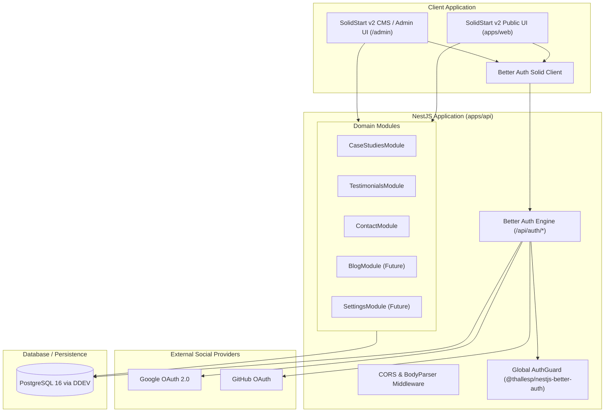

# Comprehensive Migration & Architecture Plan
## SolidStart v2 + NestJS + Better Auth + CMS, Blog & Site Settings

This document contains the complete, step-by-step architectural design and execution plan for pairing **SolidStart v2** with **NestJS**, incorporating **Better Auth** with Google and GitHub social logins, and providing an extensible foundation for a **Blog System**, **Headless CMS**, and **Dynamic Site Settings**.

---

## 1. System Topology & Environment Configuration

### 1.1 Architecture Diagram



---

## 2. Multi-Tier Environment Strategy

All sensitive credentials and environment variables follow a strict 3-tier precedence hierarchy:

```
apps/api/.env.development.local  (Highest precedence - git-ignored)
       ↓
apps/api/.env.development        (Shared development presets - git-ignored)
       ↓
apps/api/.env                    (Base fallback defaults - git-ignored)
       ↓
apps/api/.env.example            (Committed template with placeholder keys)
```

### Configured Environment Variables:
- `PORT=3000`
- `NODE_ENV=development`
- `BETTER_AUTH_SECRET` (Minimum 32-character encryption key)
- `BETTER_AUTH_URL=http://localhost:3000`
- `CLIENT_URL=http://localhost:5173`
- `GOOGLE_CLIENT_ID` & `GOOGLE_CLIENT_SECRET` (dummy values for local dev)
- `GITHUB_CLIENT_ID` & `GITHUB_CLIENT_SECRET` (dummy values for local dev)

---

## 3. Better Auth + NestJS Integration Plan

### 3.1 Backend Configuration (`apps/api`)
1. **Raw Body Handling**:
   - Better Auth requires direct access to incoming raw payloads for webhook and authentication signature verification.
   - Configured in `NestFactory.create(AppModule, { bodyParser: false })`.
2. **Better Auth Engine (`src/auth.ts`)**:
   - Initialized using `betterAuth({ socialProviders: { google, github } })`.
   - Configured with `trustedOrigins` including both API and frontend ports (`http://localhost:5173`).
3. **Module Registration (`src/app.module.ts`)**:
   - Registered using `AuthModule.forRoot({ auth })` from `@thallesp/nestjs-better-auth`.
   - Injects a global `AuthGuard`.
4. **Endpoint Protection Pattern**:
   - **Protected by Default**: Any controller endpoint requires a valid user session.
   - `@AllowAnonymous()` decorator for public portfolio endpoints (`/`, `/health`, `/api/case-studies`, `/api/testimonials`, `/api/contact`).
   - `@Session() session: UserSession` decorator to inject the authenticated user in admin/protected routes.

---

## 4. Phase-by-Phase Roadmap

### Phase 1: Authentication & Content API Verification (Current Focus)
- [x] Create dedicated git branch `migrate/solidstart-nestjs`.
- [x] Setup DDEV container with `ddev-pnpm` (`pnpm v12`).
- [x] Configure pnpm workspace monorepo (`apps/web`, `apps/api`).
- [x] Scaffold latest NestJS v12 with ESM.
- [x] Scaffold latest SolidStart v2 (`@solidjs/start@^2.0.0`) with Vite & TypeScript.
- [x] Set up `.env.*` structure (`.env`, `.env.development`, `.env.development.local`, `.env.example`).
- [ ] Connect Better Auth to DDEV database (MariaDB / PostgreSQL / SQLite).
- [ ] Create initial fine-grained API modules in `apps/api`:
  - `CaseStudiesModule`: Serves portfolio case studies.
  - `TestimonialsModule`: Serves testimonials.
  - `ContactModule`: Validates and receives contact inquiries.

---

### Phase 2: Frontend Migration to SolidStart v2 (`apps/web`)
- [ ] Install styling & UI dependencies (TailwindCSS v4, Lucide icons, fonts).
- [ ] Port shared layouts (`Header`, `Footer`, `ThemeSwitcher`).
- [ ] Port home page sections to SolidJS reactive components:
  - `Hero`
  - `Services`
  - `Experience`
  - `CaseStudies` (fetching data from `apps/api`)
  - `Testimonials` (fetching data from `apps/api`)
  - `Contact` (submitting to `apps/api/contact`)
- [ ] Add Better Auth client SDK (`better-auth/solid`) for frontend session management & login buttons.

---

### Phase 3: Future Blog System
- [ ] **Backend (`apps/api`)**:
  - `BlogModule`: Manage posts, categories, tags, slugs, drafts, and publication dates.
  - Markdown / MDX parsing service with code syntax highlighting and read-time calculation.
- [ ] **Frontend (`apps/web`)**:
  - `/blog`: Blog listing page with search, tag filters, and pagination.
  - `/blog/[slug]`: Post detail page with reading progress bar, table of contents, and SEO tags.

---

### Phase 4: Future Dynamic Site Settings
- [ ] **Backend (`apps/api`)**:
  - `SettingsModule`: Key-value JSON storage for site metadata, social URLs, bio, contact email, and resume link.
  - Public endpoint: `GET /api/settings/public` (cached in-memory).
  - Admin endpoint: `PATCH /api/settings` (guarded by Better Auth admin role).
- [ ] **Frontend (`apps/web`)**:
  - Global `SiteSettingsContext` in `apps/web/src/app.tsx` for zero-redeploy configuration updates.

---

### Phase 5: Future CMS / Admin Portal
- [ ] **Backend RBAC**:
  - Add admin role support in Better Auth (`admin`, `editor`).
  - Guards for `/api/admin/*` endpoints.
- [ ] **Frontend UI (`/admin`)**:
  - Authenticated admin dashboard layout.
  - Visual Case Studies & Blog Post editor with live markdown preview.
  - Inquiry inbox to review messages submitted through the contact form.
  - Site Settings editor UI.
